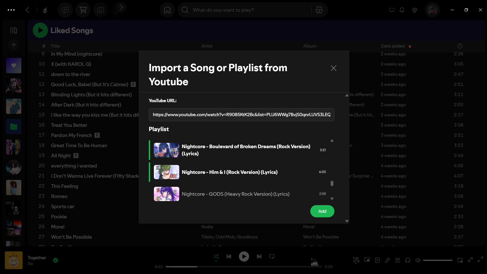
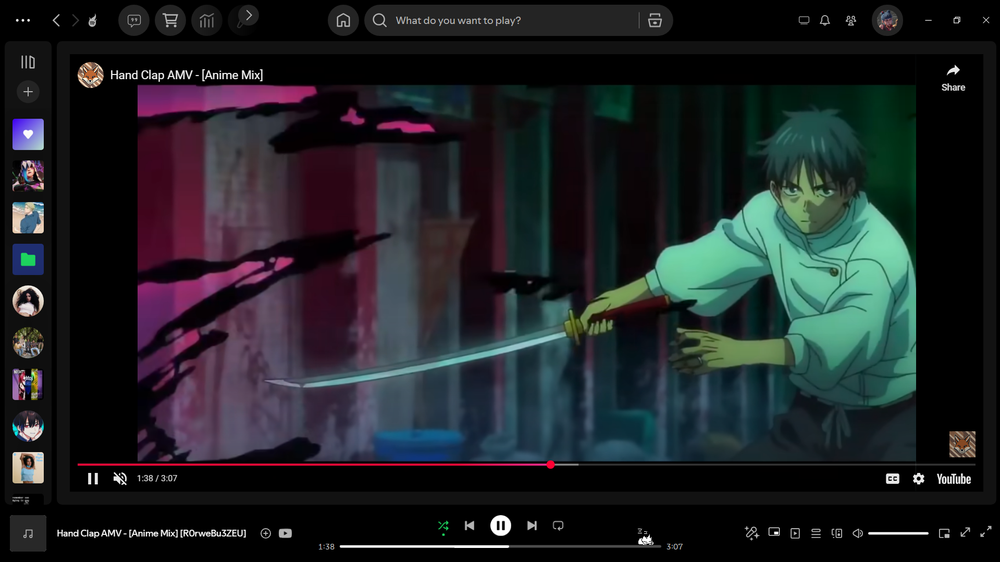

<h1 align="left">
  YouTube Importer for Spicetify
  
</h1>

A simple extension for **Spicetify** that lets you input a link to a public video or playlist from YouTube and directly download it.



---

## Features

- Download **individual YouTube videos** as MP3 files
- Download **entire playlists**, with optional selection of specific videos
- Inbuilt **YouTube player** to view videos for the downloaded audio
- Fully integrated inside Spotify using **Spicetify**
- Includes a built-in **tutorial** for first-time users

&nbsp;


---

## Prerequisites

- Installed [Spotify Desktop](https://www.spotify.com/)
- Installed and configured [Spicetify](https://spicetify.app/)

---

## Installation

- Install [Spicetify Marketplace](https://github.com/spicetify/marketplace)
- Search "Youtube importer" on the marketplace and install it

## Manual Installation

1. Clone or download this repository
2. Copy the folder to your Spicetify extensions directory:

```bash
# Example path for Windows
%userprofile%\.spicetify\Extensions
```

3. Enable the extension using **Spicetify CLI**

```bash
spicetify config extensions spicetify-youtube-importer.js
spicetify apply
```

---

## Usage

1. Open Spotify and locate the **"Add from YouTube"** button:

   - Found in the **Create** button's context menu (new playlist, folder, etc.)
   - Or in the **right-click context menu** anywhere in Spotify

2. Complete the tutorial (on first use)
3. Paste a **YouTube video or playlist URL** into the input field
4. Choose where you'd like to save the file(s)
5. Grant permissions when prompted (browser & file access)

<br>

> ⚠️ **Notes:**
>
> - If you encounter `NaN:NaN` as the duration with no title or thumbnail, try putting the video into a playlist and using that playlist link
> - Stay tabbed in during downloads and grant necessary browser permissions for file saving
> - Ensure **Local Files** are enabled in Spotify settings and the download location is set appropriately
> - If a download comes up as failed simply retry, file handle permissions are often times the issue

---

## Further Development

1. Clone the repository
2. Install dependencies

```bash
npm install
```

3. Build at least once

```bash
npm run build
```

4. Start watching

```bash
npm run watch
```

5. Load spicetify into watch mode

```bash
spicetify watch -le
```

For more information see
[Spicetify Creator Documentation](https://spicetify.app/docs/development/spicetify-creator/)

---

## Contributing

Contributions are welcome! If you'd like to improve this project:

- Fork the repo
- Create a new branch
- Open a pull request with your changes

Please ensure your code is clean and documented where needed.
